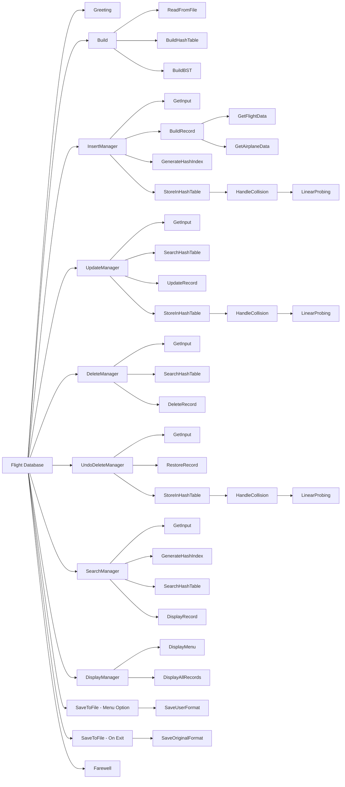

```mermaid
graph LR
    FD[Flight Database]

    FD --> Greet[Greeting]
    FD --> Build[Build]
    Build --> ReadFile[ReadFromFile]
    Build --> BuildHash[BuildHashTable]
    Build --> BuildBST[BuildBST]

    FD --> Insert[InsertManager]
    Insert --> I_GetInput[GetInput]
    Insert --> I_BuildRecord[BuildRecord]
    I_BuildRecord --> I_GetFlight[GetFlightData]
    I_BuildRecord --> I_GetAirplane[GetAirplaneData]
    Insert --> I_GenHash[GenerateHashIndex]
    Insert --> I_Store[StoreInHashTable]
    I_Store --> I_Collision[HandleCollision]
    I_Collision --> I_Linear[LinearProbing]

    FD --> Update[UpdateManager]
    Update --> U_GetInput[GetInput]
    Update --> U_Search[SearchHashTable]
    Update --> U_UpdateRec[UpdateRecord]
    Update --> U_Store[StoreInHashTable]
    U_Store --> U_Collision[HandleCollision]
    U_Collision --> U_Linear[LinearProbing]

    FD --> Delete[DeleteManager]
    Delete --> D_GetInput[GetInput]
    Delete --> D_Search[SearchHashTable]
    Delete --> D_DeleteRec[DeleteRecord]

    FD --> Undo[UndoDeleteManager]
    Undo --> Un_GetInput[GetInput]
    Undo --> Un_Restore[RestoreRecord]
    Undo --> Un_Store[StoreInHashTable]
    Un_Store --> Un_Collision[HandleCollision]
    Un_Collision --> Un_Linear[LinearProbing]

    FD --> Search[SearchManager]
    Search --> S_GetInput[GetInput]
    Search --> S_GenHash[GenerateHashIndex]
    Search --> S_Search[SearchHashTable]
    Search --> S_Display[DisplayRecord]

    FD --> Display[DisplayManager]
    Display --> Disp_Menu[DisplayMenu]
    Display --> Disp_All[DisplayAllRecords]

    FD --> SaveMenu[SaveToFile - Menu Option]
    SaveMenu --> Save_User[SaveUserFormat]

    FD --> SaveExit[SaveToFile - On Exit]
    SaveExit --> Save_Orig[SaveOriginalFormat]

    FD --> Farewell[Farewell]

```

